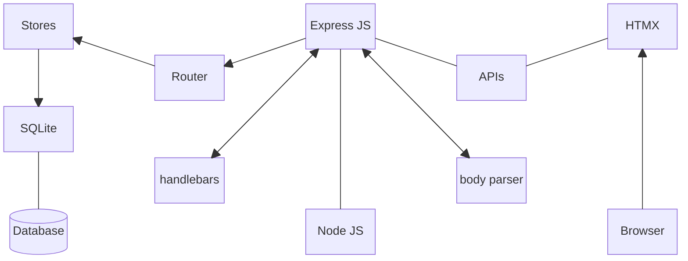

# htmx-sqlite-todo

A To-Do example based on HTMX and backed by SQLite.

Supported by NodeJs, Express, Handlebars and Body Parser.

## Scripts

- start: Starts the node/express server in watch mode.
- server: Configures the database to a known initial state. This uses the `todos_db.js` script file.

## Server (Node/Express)

This web/app server is configured to expose an hypermedia API using Express Router (`toDoRouter.js`). The templates are supplied using the (express-) handlebars view engine (`views` folder).

Data persistence is provided by a SQLite database file through the `better-sqlite3` package, as applied by the `toDo.js` module.

## Client (HTMX)

The main index.html file is composed from the `index` layout, wrapped around the `main` view. Then `index` layout also beings in the CSS file and a JS script. It also imports the HTMX library.

The web client issues the following API calls in response to user interaction.

- Read all - `hx-get='/todos' hx-trigger='load'` pulls in a list of all stored toDos as the screen loads.
- Create - `hx-post='/todos'` is fired when the submit button is pressed to create a new toDo entry.
- Delete - Each entry in the list of toDos can be removed using the `hx-delete='/todos/{{toDo.id}}'` action.
- Update - Also within each entry also has the ability to be marked as DONE, which results in the `hx-put='/todos/{{toDo.id}}?done={{toDo.done}}'` call being issued.

The files in the `views/partials` are used to build the main screen but also act as individual HTMX templates to respond to API requests.

## Architecture

